# Colours in `ggplot2` - Data Visualisation 🌈 

*created by Tegan Williams - last updated 2nd December 2022*

###  🐾 Tutorial Aims and Steps 

#### <a href="#section1"> 1. Foundations of colour in ggplot2 </a>
 - <a href="#section1.1"> 1.1. Background on Colour in Data Visualisation </a>
 - <a href="#section1.2"> 1.2. Key Colour Functions and Uses </a>

#### <a href="#section2"> 2. Adding complexity</a>
 - <a href="#section2.1"> 2.1. Intro to Packages
 - <a href="#section2.2"> 2.2. Viridis 
 - <a href="#section2.3"> 2.3. RColorBrewer
 - <a href="#section2.4"> 2.4. Scientific journal palettes (ggsci)
 - <a href="#section2.5"> 2.5. Wes Anderson 
 
#### <a href="#section3"> 3. Compare and challenge yourself</a>

### 🌱 Learning Objectives 

By the end of this tutorial you should be able to:

* Understand the importance of colour in figures
* Use basic colour functions in any type of ggpplot2 graph
* Know how to create your own colour palette to fit your goals
* Apply various colour packages to your data visualisations

----------------------------

Following from the [general `ggplot2` syntax and various plot types](https://ourcodingclub.github.io/tutorials/datavis/) and some [more advanced plotting in data vis 2](https://ourcodingclub.github.io/tutorials/data-vis-2/), we are now diving deeper into colours and beautification in `ggplot2`. 

Since data visualisation is a fundamental part of many subjects, the ability to customise figures is key and does not need to be a complicated concept to learn. The focal aim of this tutorial is to give you a deeper understanding of the possibilities that `ggplot2` can offer you in the form colour. 

Аll the files you need to complete this tutorial can be downloaded from this [Github folder](/Tutorial). Clone and download the folder as a zip file, then unzip it.

<a name="section1"></a>
## 1.  Foundations of colour in ggplot2 🌋
<a name="section1.1"></a>
### 1.1.  ⛵ Background on colour in Data Visualisation

Colours are a fundamental aspect of data visualisation, especially because they tend to be the first thing people notice about a figure. For most, the initial thoughts we have about a graph are based on the colours we see, which can either intrigue us to understand it or make us completely uninterested. We see obvious examples of this daily, for example a poster in the street generally loses value if it is not well coloured, no matter the content. On the other hand, when colour is used well or even ingeniously, it can truly add to the content and our perception. Although for scientific graphs colour is not generally top priority, it can make or break the results. To illustrate that, let's look at 2 visualisations of the same data:

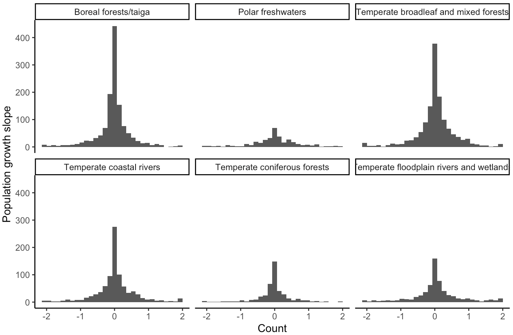 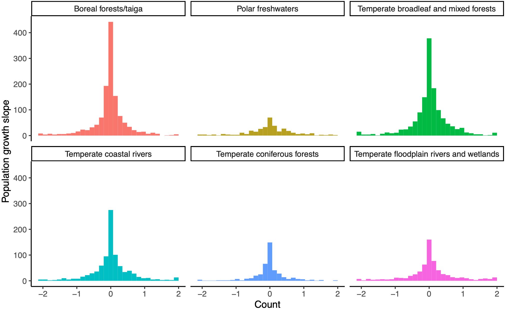

This compares the effects of colour on plot beauty, where it is generally nicer to look at the colourful one (unless you like boring colours). The best part is that it is a very simple function to change in the plot code and adding a little bit more complexity on top can further the originality of it, for instance using a distinct colour palette.

Although having a pretty graph is nice, the the most important function colour can have in data visualisation is to help with data interpretation. If we look at the next plots, we can begin to interpret the effect of biome on count simply from the colour (last plot). Of course we can also tell from the size of the bar, but the colour helps to accentuate the differences. The other 3 plots represent different examples of how colour can be used 'badly' or at least not in a positive way for interpretation. The 2 first ones are single-coloured, which means other than adding a bit of prettiness (e.g., pink 🐷), they do not help to visualise our results. The third plot used colour to represent individual biomes, but that makes the plot look more complicated and harder to read. Finally, the last plot uses colour as a way to accentuate the trends as well as making the plot nice 🍁.

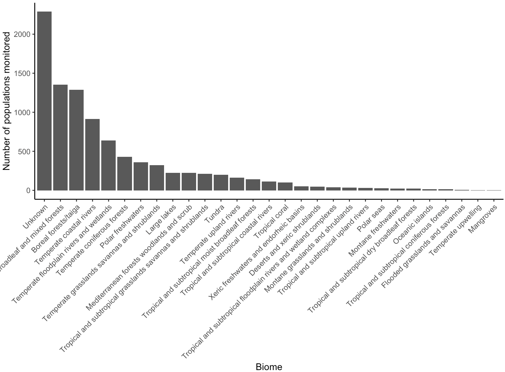 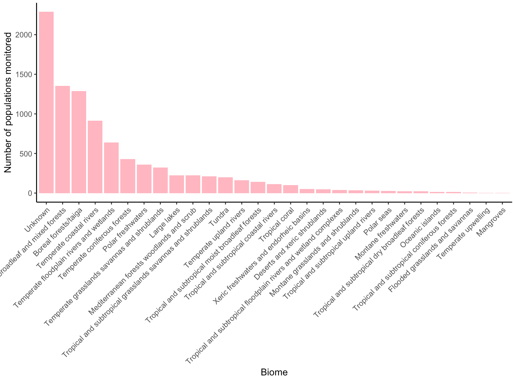 

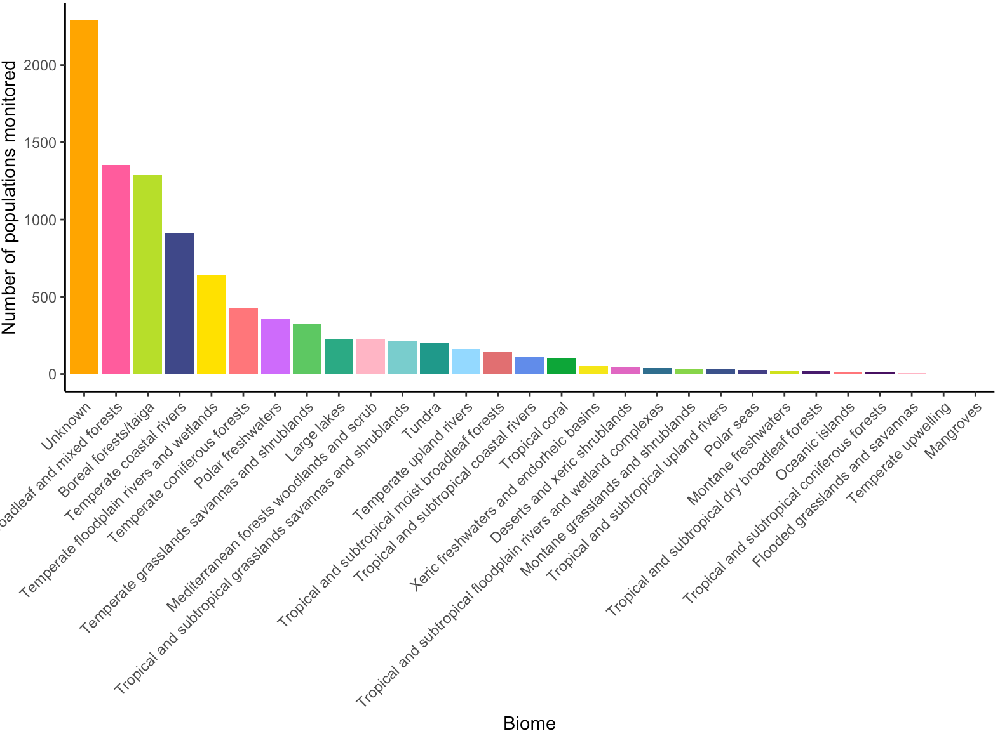 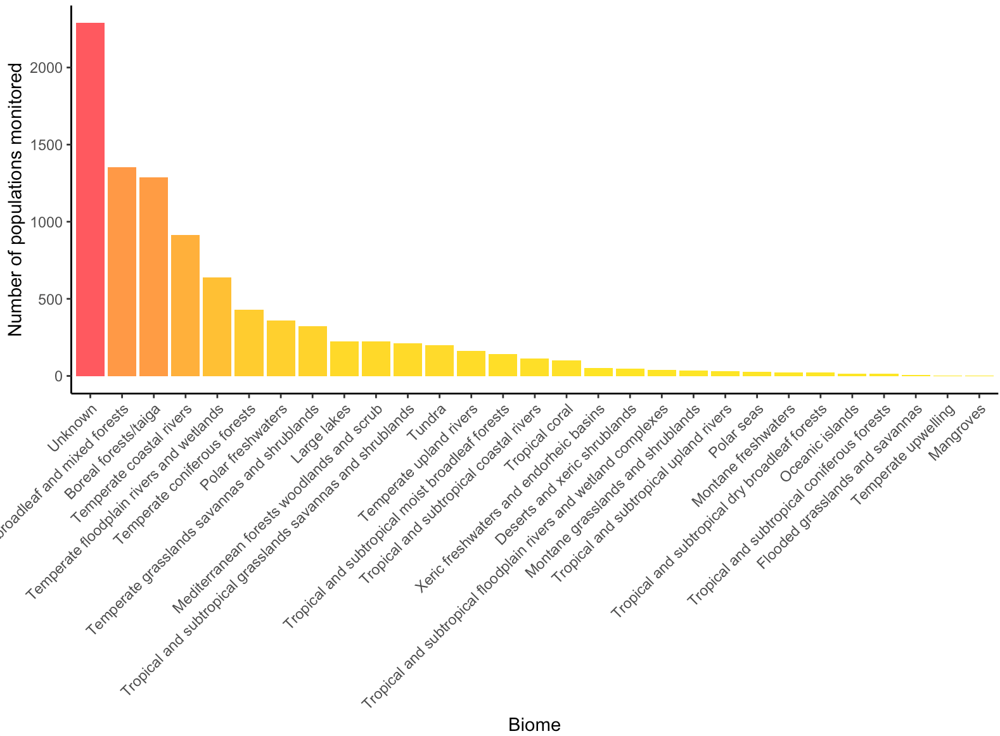 

Colour is especially useful as a way to distinguishing variables or groups within the same plot. In `ggplot2`, there are many ways to colour plots, allowing for originality in your design. You could even create a trademark theme with a specific colour palette that you always use, essentially letting people identify the plot's creator from it's style. 

In this tutorial, we will first revert back to the basics of colour in `ggplot2` using a specific example on Rank Abundace Curves which are commonly used in Ecology. Then we will dive in a bit deeper to grasp more complex functions, with the use of different colour packages. Finally, you should be able to create your own style of colour in your plots and make use of it depending on your research question and audience. 

<a name="section1.2"></a>
### 1.2. 🎨: Key functions and uses

Although the basic colour functions were mostly covered in the 2 data visualisation tutorials mentioned, they were quite spread out among the other functions and can take some time to find. For that reason, let's start by briefly summarise the key concepts learned as we gradually work through our data to observe the effects of different uses of colour in plots. 

To put them into **context**, we are going to be using a real dataset of micro-organism species abundance in a *Sphagnum* mesocosm. Three microhabits were sampled: water, moss and sediment. For each group, relative abundance of 39 different species was counted and ranked accordingly. As stated above, you can download all necessary files for this tutorial [here](/Tutorial) and save it as your own workspace for future reference. Now open the R colour script and begin following along and making changes as you please.

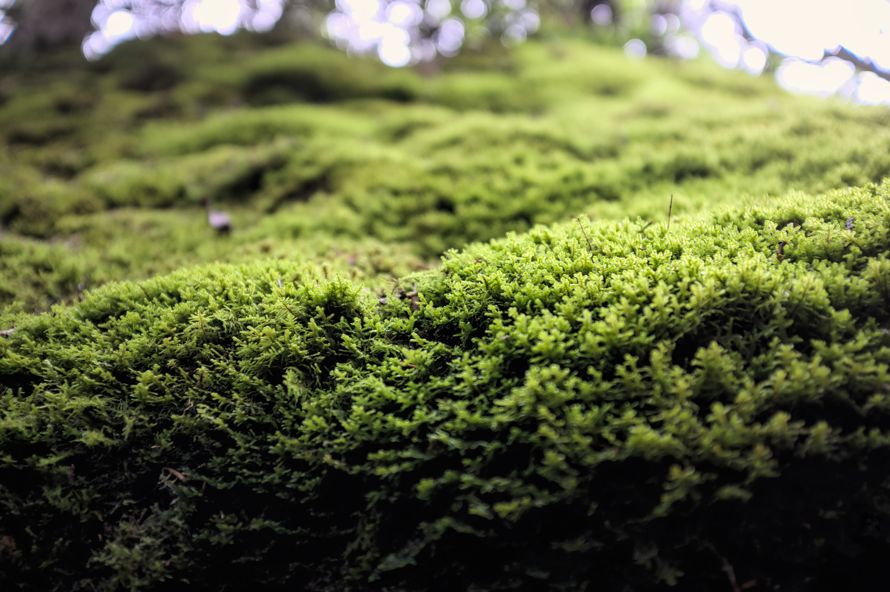 

*(Photo by Eric Prouzet on Unsplash)*


As always, start by downloading the necessary libraries and loading the dataset: 
``` r
#### Libraries
library(tidyverse) # includes ggplot2

#### Load and explore the data ---
moss <- read_csv("Tutorial/RankAbundance.csv")
view(moss)
str(moss)
```

For the purpose of this tutorial we are going to look at a specific type of graph often used in Ecology, know as a Rank-Abundance Curve. Since it is commonly seen in reality it proves to be a good example of scientific visualisation to which we can add different layers of colour, especially because our data is split into 3 groups.

Before we begin visualising, we have to wrangle the dataset slightly to get applicable variables for a rank abundance graph, since we need columns for relative abundance, rank and type of microhabitat (group). To do that we will use the function `pivot_longer()` which allows us to move our values from each microhabitat into one collum and put the microhabitat names in a seperate one too.

``` r
rankabundance <- moss %>% 
  pivot_longer(cols = 2:4, names_to = "microhabitat", values_to = "relativeabundance", values_drop_na = TRUE) %>% 
  rename(rank=Rank)
```

Now we can begin our data visualisation process

#### 1.1.1. Plotting without colour functions

Let's start by looking at what ggplot2 would create without adding any colour functions to our plot code, so that we can compare it later:

``` r
# a) Scatter with no use of colour functions
(rank_abundance0.1 <-  ggplot(data = rankabundance, 
                              aes(x = rank , 
                                  y = relativeabundance,
                                  group = microhabitat)) +
    geom_point(size = 2.5, shape=18) +
    geom_line(size = 0.7) +
    ylim(0, 0.4) +
    labs(x="Rank", y="Relative Abundance") +
    theme_classic() +
    theme(text = element_text(size = 13),
          legend.position = c(0.8, 0.8),
          axis.title.x = element_text(margin=margin(t=8)), 
          axis.title.y = element_text(margin=margin(r=8))))
```
``` r
# b) Bar plot wih no colour functions
(rank_abundance0.2 <-  ggplot(data = rankabundance, 
                              aes(x = rank , 
                                  y = relativeabundance)) +
    geom_bar(stat = 'identity', 
             position=position_dodge(),
             aes(group = microhabitat)) +
    geom_smooth(se = F, size = 0.6) +
    ylim(0, 0.4) +
    labs(x = "Rank", y = "Relative Abundance") +
    theme_classic() +
    theme(text = element_text(size = 13),
          legend.position = c(0.8, 0.8),
          axis.title.x = element_text(margin=margin(t=8)), 
          axis.title.y = element_text(margin=margin(r=8))))
```

Notice we did still group into microhabitats, but no colour functions were applied. Careful, always remember to include grouping and colour functions to the aesthetics aes(), otherwise you will get an Error saying the object was not found. 

Here are the figures produced:

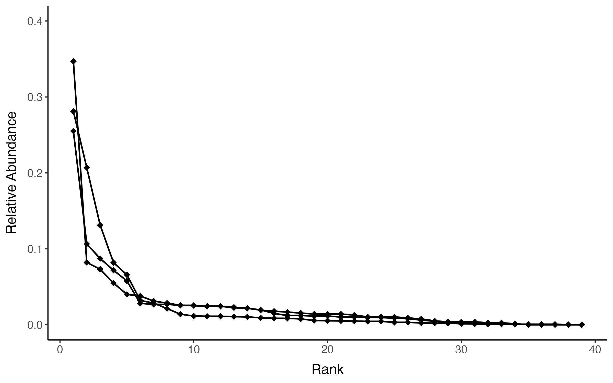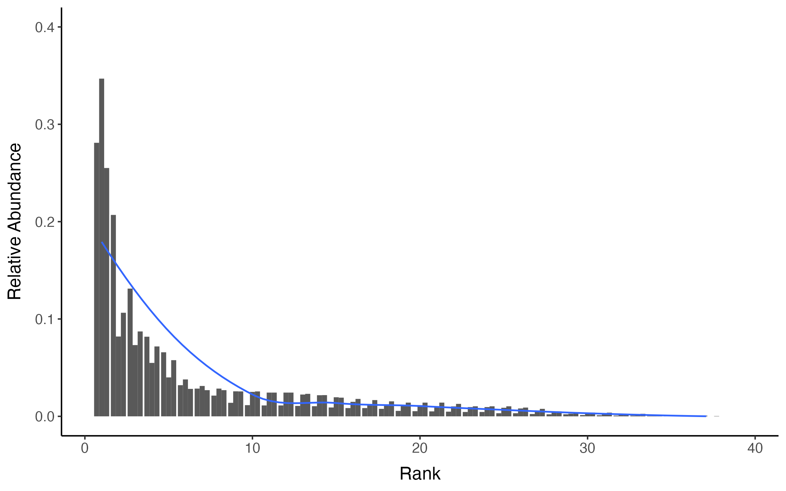

As you can see, the default settings are black points and lines in the scatter, and grey bars for the barplot with a blue line for the `smooth()` function. In these initial plot, although our data is grouped, it is difficult to see the variation between them due to the values being quite close together. One very simple way to improve this is of course with the use of colours!

#### 1.1.2. Picking colours

Selecting colours in R can be quite straighforward and you can use various methods. The easiest way is to use the "Colour Picker" within R, which allows you to choose from all possible colours.

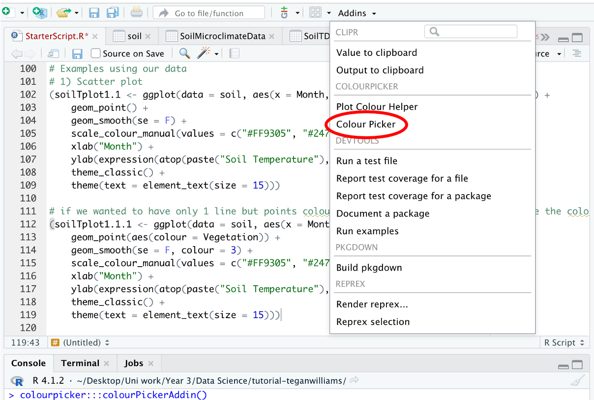 

You can then create a 'list' of colour HEX numbers, which are assigned to specific colours. Or you can choose from a range of pre-made colours.

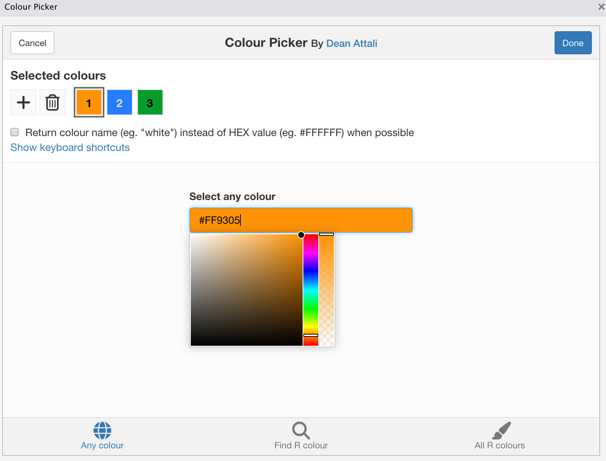 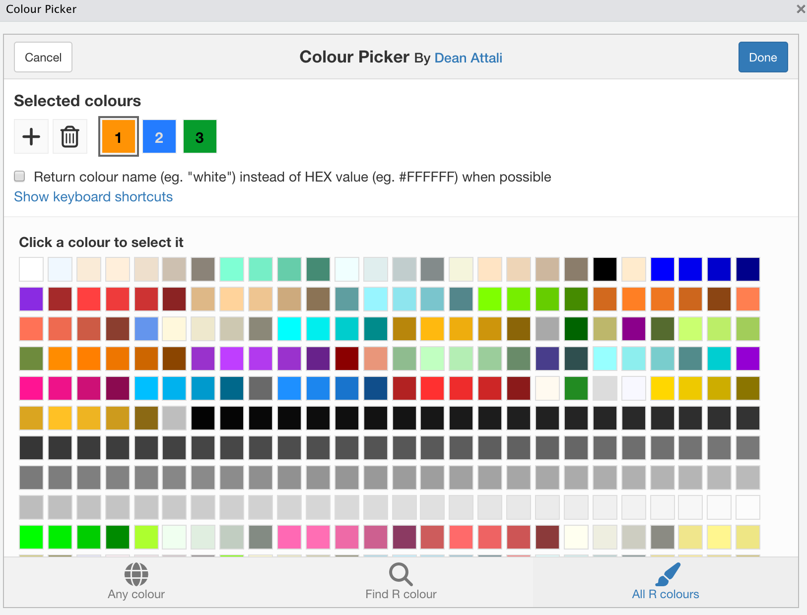

As well as HEX numbers, R assigns simple numbers and names to colours, which you can find in the [R colours guide](/Tutorial/R_colours_guide.pdf). 

Some examples:
- by **name** -> e.g., `colour = "darkblue"`.
- by **number** -> e.g., `fill = "2"`. 

Once you have chosen your colours, you can make them into a palette to simplify colouring plots later on:

``` r
# Make your own palette
# Our data has 3 factor levels, so we have to select at least 3 colours:

mypalette <- c("#FF9305", "#07BA3A", "#247CFF") # creates a 'vector' or list of 3 colours!

# the order you have put the colours in will define which group they correspond to
# in this case, since grass comes first alphabetically, it gets allocated the first colour
```

#### 1.1.3. Adding simple colour functions

Now it's time to add the 🧚‍♀️colour🧚‍♀️! There are two ways that `ggplot2` adds colour to graphs: 

- `colour = x`, when plotting points, lines and text
- `fill = x`, to apply colour to box plots, bar plots, histograms, density plots etc.

where x is either the colour we want or the variable we are grouping by *(note that 'color' is the same as 'colour')*

For groups, we can then use the functions 'scale_colour_manual()' or 'scale_fill_manual()' to change the colour of each individual group. Again, the difference between them is the type of plot used. 

Let's give a quick example for each of these being used on our dataset:

``` r
# c) Scatter with grouped lines
(rank_abundance1.1 <-  ggplot(data = rankabundance, 
                              aes(x = rank , 
                                  y = relativeabundance ,
                                  colour = microhabitat)) +
    geom_point(size = 2.5, shape=18) +
    geom_line(size = 0.7) +
    scale_colour_manual(values = mypalette) +
    ylim(0, 0.4) +
    labs(x="Rank", y="Relative Abundance") +
    theme_classic() +
    theme(text = element_text(size = 13),
          legend.position = c(0.8, 0.8),
          axis.title.x = element_text(margin=margin(t=8)), 
          axis.title.y = element_text(margin=margin(r=8))))
```
 
``` r
# d) Bar plot with a single smooth line
(rank_abundance1.2 <-  ggplot(data = rankabundance, 
                              aes(x = rank , 
                                  y = relativeabundance)) +
    geom_bar(aes(fill=microhabitat), 
             stat = 'identity', 
             position=position_dodge()) +
    scale_fill_manual(values = mypalette) +
    geom_smooth(se = F, colour = 1, size = 0.6) +
    ylim(0, 0.4) +
    labs(x = "Rank", y = "Relative Abundance") +
    theme_classic() +
    theme(text = element_text(size = 13),
          legend.position = c(0.8, 0.8),
          axis.title.x = element_text(margin=margin(t=8)), 
          axis.title.y = element_text(margin=margin(r=8))))
```
**Note:** the functions are very similar since we are using the same plot theme, the only differences are the way we added colour into them. For the scatter plot, we added the `colour` funtion into the core aes() because we wanted **all** the graph elements to be grouped and coloured in the same way (points **and** lines). On the other hand, for the bar plot we only added the `fill` function to the bar plot aes() because we wanted to keep the smooth line **ungrouped** and chose to colour it black using `colour = 1`. We used the exact same values for the colours, where we stated three because we have 3 groups. 
That code gives us:

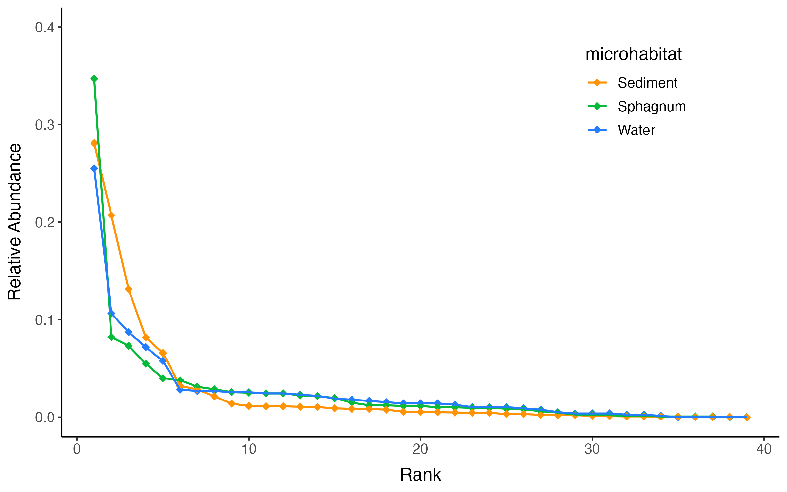 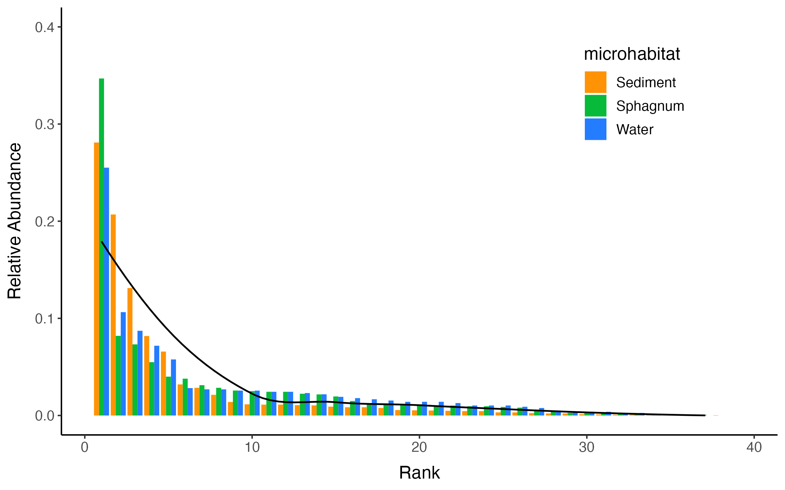

This already looks much better, but it could still be improved, especially the bar plot. Since relative abundance is continuous, we can use it to give our plot a colour gradient to accentuate our results.

The function for this is `scale_fill_gradient()` (or `scale_colour_gradient()` if we were using the scatter plot).

To use it, simply add the function after having grouped by the continuous variable (you will get an error if it is a discrete variable), instead of 'scale_colour_manual()' or 'scale_fill_manual()'. In the brackets you have to specify high and low colours.

There are other, more advanced versions of these as well: 
- `scale_colour_gradient2()` or `scale_fill_gradient2()`, where we can add a mid point colour for diverging scales.
- and `scale_colour_gradientn()` or `scale_fill_gradientn()`, where we are adding an n-colour gradient.

We will have a closer look into 'scale_colour_gradientn() later on (go to **<a href="#section2.5"> Wes Anderson</a>** section).

``` r
# e) Gradient bar plot
(rank_abundance1.3 <-  ggplot(data = rankabundance, 
                              aes(x = rank , 
                                  y = relativeabundance)) +
    geom_bar(aes(fill=relativeabundance), 
             stat = 'identity', 
             position=position_dodge()) +
    scale_fill_gradient(low = "#FF9305", high =  "#07BA3A") +
    geom_smooth(se = F, colour = 1, size = 0.6) +
    ylim(0, 0.4) +
    labs(x = "Rank", y = "Relative Abundance", fill = "Relative Abundance") +
    theme_classic() +
    theme(text = element_text(size = 13),
          legend.position = c(0.8, 0.8),
          axis.title.x = element_text(margin=margin(t=8)), 
          axis.title.y = element_text(margin=margin(r=8))))
 ```
 ``` r
# f) Grouped gradient bar plot
(rank_abundance1.4 <-  ggplot(data = rankabundance, 
                              aes(x = rank , 
                                  y = relativeabundance)) +
    geom_bar(aes(fill=relativeabundance, group = microhabitat), 
             stat = 'identity', 
             position=position_dodge()) +
    scale_fill_gradient(low = "#FF9305", high =  "#07BA3A") +
    geom_smooth(aes(colour = microhabitat), se = F, size = 0.5) +
    scale_colour_manual(values = c("black", "firebrick3", "red")) +
    ylim(0, 0.4) +
    labs(x = "Rank", y = "Relative Abundance", fill = "Relative Abundance", colour = "Microhabitat") +
    theme_classic() +
    theme(text = element_text(size = 13),
          legend.position = c(0.8, 0.6),
          axis.title.x = element_text(margin=margin(t=8)), 
          axis.title.y = element_text(margin=margin(r=8))))                  
  ```                     
 The first plot creates a gradient bar plot for the three groups combined, assessing overall diversity, whereas the second bar plot groups them to see whether the community diversity is the same accross microhabitats. 

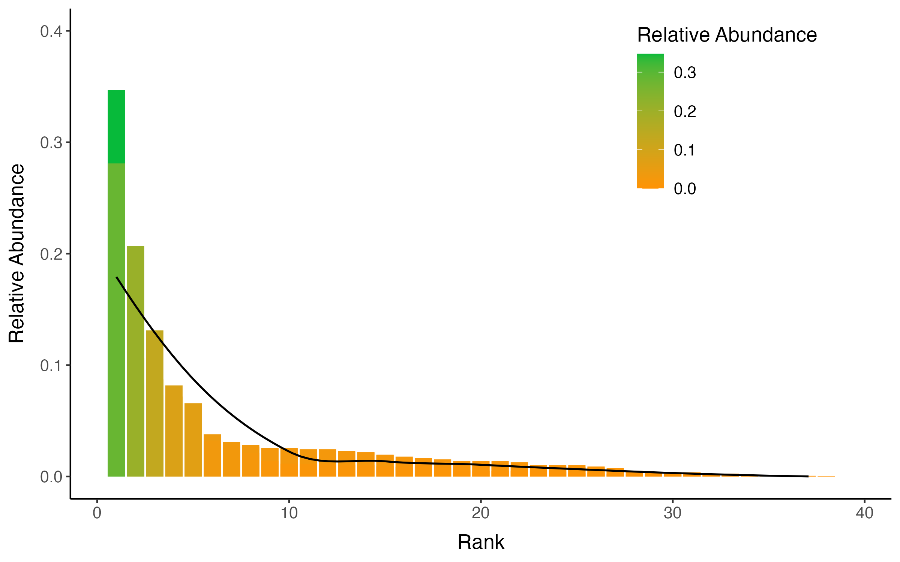 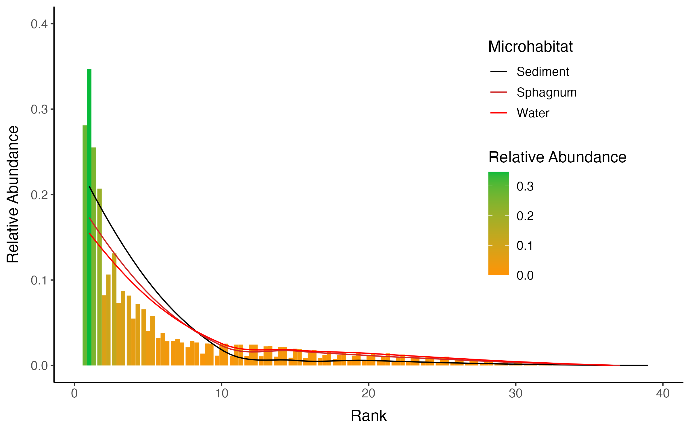 

Which of the two better represents our data? That utterly depends on your research question. If we were only interested in seeing the average rank abundance in the community then the first figure illustrate it best. But if we are asking whether there is variance between the 3 microhabitats, then we should use the latter or the intial scatter plot made earlier. 

Whichever one of the coloured plots you choose, they are all better options than those first two that did not contian colour functions! 

Remember to **save your plots** using:
``` r
ggsave(plotnameinR, filename = "Tutorial/Figures/Recap/plot.png", device = "png", width= 8, height=5)
```
You can set your file directory to wherever you want to find the plot and change width and height depending on preference and use.

<a name="section2"></a>
## 2.  Adding complexity 🔥 
Now we are moving onto more 'serious' colouring using packages. You may be content with your own colour palette, but for bigger data sets, larger numbers of colour values are required. 
 
<a name="section2.1"></a>
### 2.1. Introduction to Packages
In R, a package is defined as an extension of the R coding language. This means by installing additional packages, you gain access to more code to implement to your plots. There are a four well known packages that work well in ggplot2:

- Viridis color scales
- RColorbrewer
- Scientific journal colour palettes (ggsci)
- Wes Anderson colour palettes

We will now investigate and practice using each of these to see in what ways they may be useful. 

<a name="section2.2"></a>
### 2.2. Viridis 

Since we're dealing with a package, we first need to dowload and load it into our session:
 
``` r
# Install and Load the package
install.packages("viridis")  
library("viridis")     
```

Viridis colour palettes can be applied to `ggplot2` using the following functions:

 - `scale_colour_viridis()` , for points, lines and text
 - `scale_fill_viridis()` , for box plots, bars, histograms etc.

**Note:** you have to add `(option = 'X')` and choose between the 4 viridis palettes

- Magma is 'A'
- Inferno is 'B'
- Plasma is 'C'
- Viridis, aka original, is 'D' (or default)
 
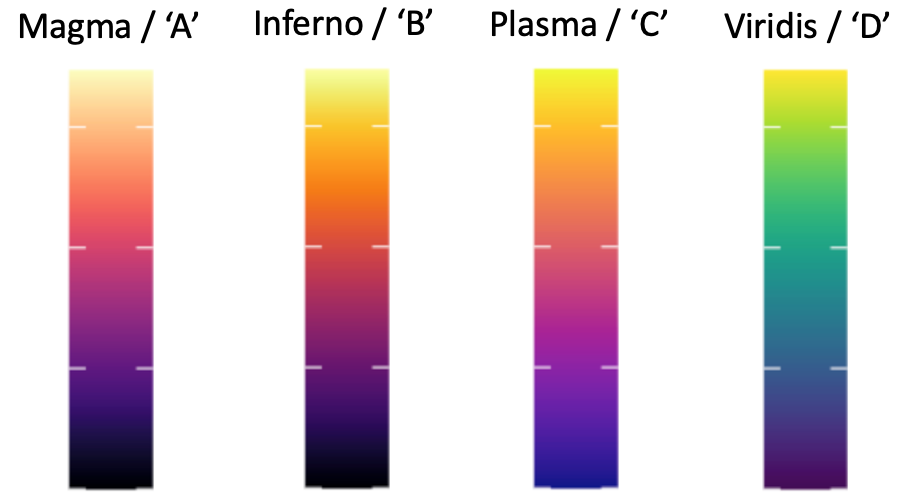
 
Ok, so the first three do seem very similar, but you'd be surprised how different they look on graphs. 

The viridis package can generate 'n' number of colours from each of its palettes in HEX format. To do so, use the following functions, with the number of colours wanted in brackets.

``` r
# Since we have 39 ranks, let's have a look at 39 colour options from each:
viridis(39)
magma(39)
inferno(39)
plasma(39)
```
 
The outputs from these functions gives us 4 lists of 39 colours: 
 
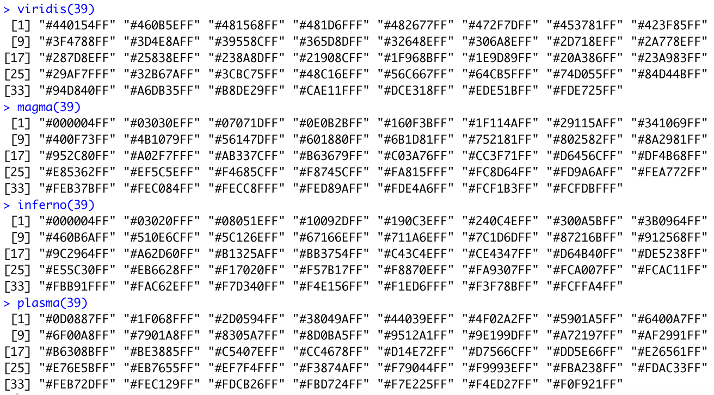
 
Now let's practice using one for different purposes! Personally plasma (C) looks best for this data, but feel free to try out the other palettes to compare and find your favourite. 
 
Since viridis has a gradient scale, we can apply it similarly to earlier in our bar plots, but this time let's use a scatter plot to change it up.

``` r
(viridis1 <-  ggplot(data = rankabundance, 
                     aes(x = rank , 
                         y = relativeabundance ,
                         colour = relativeabundance,
                         group = microhabitat)) +
    geom_point(size = 2.5, shape=18) +
    geom_line(size = 0.7) +
    scale_colour_viridis(option = 'C', direction = -1) +
    ylim(0, 0.4) +
    labs(x = "Rank", y = "Relative Abundance", colour = "Relative Abundance") +
    theme_classic() +
    theme(text = element_text(size = 13),
          legend.position = c(0.8, 0.8),
          axis.title.x = element_text(margin=margin(t=8)), 
          axis.title.y = element_text(margin=margin(r=8))))
```
             
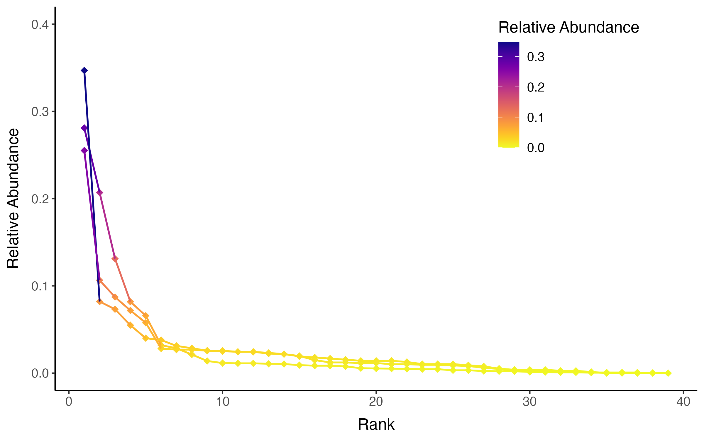
 
We added `direction = -1` to `scale_colour_viridis()` so that the high abundance values were dark and the low abundance values were light. If you prefer them the other way then simply remove the direction element from `scale_colour_viridis()`. That looks pretty good, once again we can see that how colour accentuates the results.
 
Now let's use viridis to see variation between our groups, similarly to in part 1.
 
``` r
(viridis2 <-  ggplot(data = rankabundance, 
                     aes(x = rank , 
                         y = relativeabundance ,
                         colour = microhabitat)) +
    geom_point(size = 2.5, shape=18) +
    geom_line(size = 0.7) +
    scale_colour_viridis(option = 'C', discrete = TRUE) +
    ylim(0, 0.4) +
    labs(x = "Rank", y = "Relative Abundance", colour = "Microhabitat") +
    theme_classic() +
    theme(text = element_text(size = 13),
          legend.position = c(0.8, 0.8),
          axis.title.x = element_text(margin=margin(t=8)), 
          axis.title.y = element_text(margin=margin(r=8))))
```
**Note:** we added `discrete = TRUE` to the function because the microclimate variable is not continuous.             

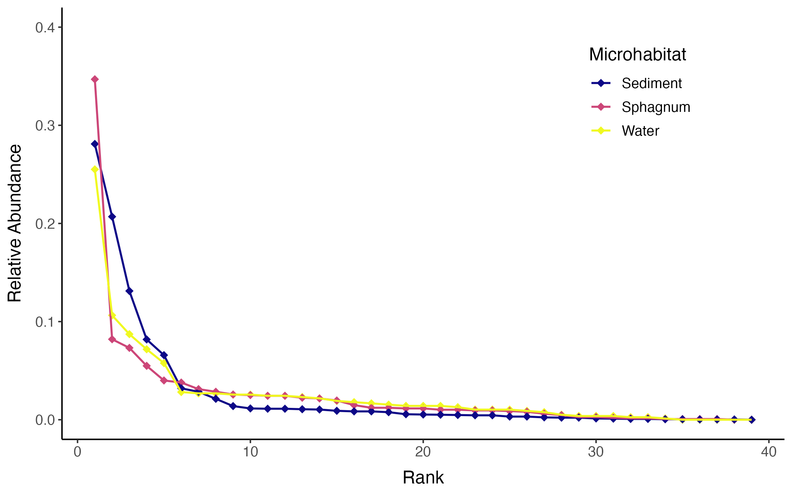

The default colours from the package include a very pale yellow, which doesn't look great here...
But we can pick our own colours from the palette:

``` r
plasma(10)

# It should look something like this:
# Output: [1] "#0D0887FF", [2] "#47039FFF", [3] "#7301A8FF", [4] "#9C179EFF", [5] "#BD3786FF", 
#         [6] "#D8576BFF", [7] "#ED7953FF", [8] "#FA9E3BFF", 
#         [9] "#FDC926FF", [10] "#F0F921FF"

# To keep the colours relatively different, we selected [2, 6, 9]
myviridispalette <- c( "#47039FFF", "#D8576BFF","#FDC926FF")
```

And now we can simply add our viridis palette to the plot, reverting back to `scale_colour_manual()`:
                    
``` r                    
(viridis3 <-  ggplot(data = rankabundance, 
                     aes(x = rank , 
                         y = relativeabundance ,
                         colour = microhabitat)) +
    geom_point(size = 2.5, shape=18) +
    geom_line(size = 0.7) +
    scale_colour_manual(values = myviridispalette) +
    ylim(0, 0.4) +
    labs(x = "Rank", y = "Relative Abundance", colour = "Microhabitat") +
    theme_classic() +
    theme(text = element_text(size = 13),
          legend.position = c(0.8, 0.8),
          axis.title.x = element_text(margin=margin(t=8)), 
          axis.title.y = element_text(margin=margin(r=8))))
```
 
 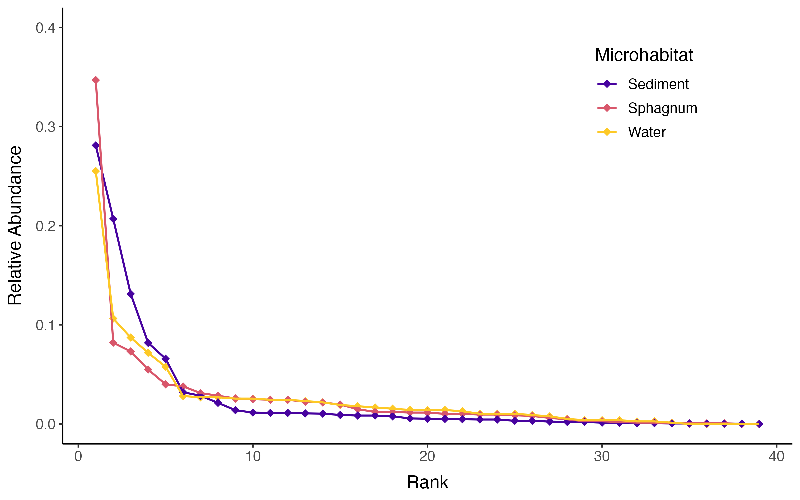
 
 Perfect! We could also apply the selected orange as the 'low' in the gradient graph since it is hard to see (simply set the high and low colours like in part 1 but using our viridis palette). 
 
 So we've managed to colour our graphs with viridis colours either by gradient for continuous data (relative abundance) or by group for discrete data (microhabitat or rank). 
 
 One key point to know about the viridis scale is that it is known to be the most **colour-blind friendly**, so if you want to appeal to all audiences it is a good option and provides you with many colour possibilities. 
 
<a name="section2.3"></a>
### 2.3. RColorBrewer
``` r  
# Load the package
library(RColorBrewer)
``` 
 
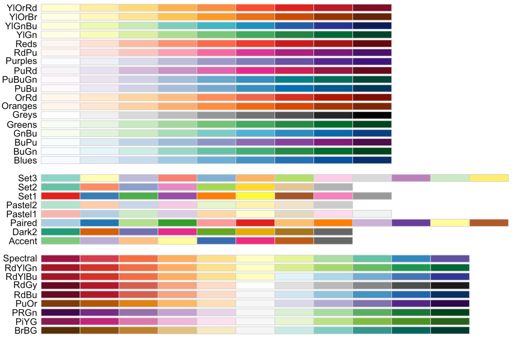

Display the palettes and their names using `display.brewer.all()`
**Note:** Refer back to the exact spelling of the names from this display when calling the palette in functions

There are 3 types of palettes produced by RColorBrewer:
 - sequential: gradient from light to dark (best for continuous variables)
 - qualitative: set of different colours (best for categorical data)
 - diverging: emphasises extreme highs and lows (generally for continuous data)

Functions:
``` r  
# 1. Get colour HEX numbers using `brewer.pal(n, 'name')`	

brewer.pal(3, 'Set2')

# Output: "#66C2A5" "#FC8D62" "#8DA0CB"

# 2. Display 'n' colours from the chosen palette in the viewer
display.brewer.pal(3, 'Set2')
```
	
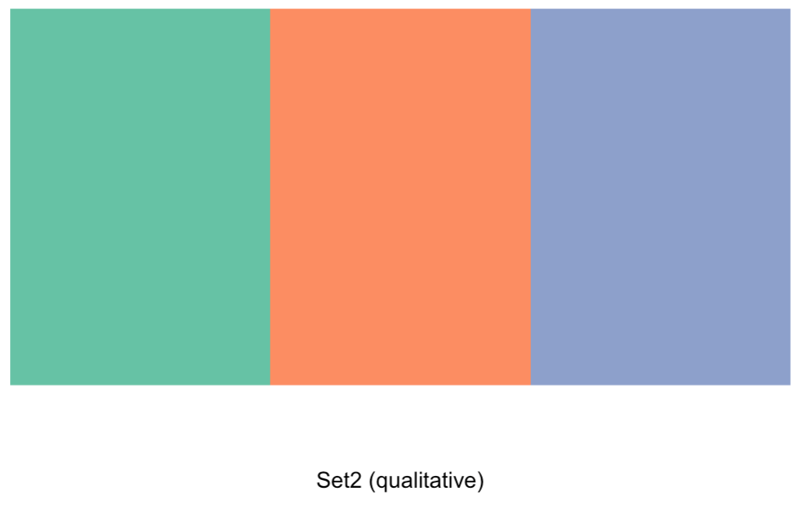
 
 
``` r  
# 3. Colour-Blind friendly palettes:
display.brewer.all(type = "all", colorblindFriendly = TRUE)
```
You can set the type of palette using 'div', 'qual', 'seq', or 'all', depending on the type of data you are using. We chose to only display all the colour-blind friendly palettes and the output gives us 27 palettes to choose from:
 
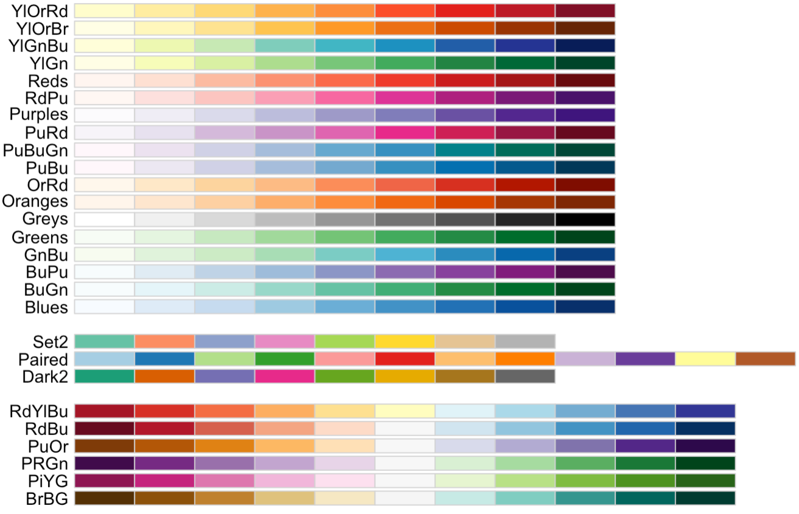

Time to use ColorBrewer in plots! Just like all colour functions, there are 2 options depending on the type of graph:
`scale_fill_brewer(palette = 'x')` and `scale_colour_brewer(palette = 'x')`

Let's use them on our data to create very different looking plots:
 
``` r  
# Scatter by group using 'Set2' palette:
(colorbrewer1 <-  ggplot(data = rankabundance, 
                     aes(x = rank , 
                         y = relativeabundance ,
                         colour = microhabitat)) +
    geom_point(size = 2.5, shape=18) +
    geom_line(size = 0.7) +
    scale_colour_brewer(palette = "Set2") +
    ylim(0, 0.4) +
    labs(x = "Rank", y = "Relative Abundance", colour = "Microhabitat") +
    theme_classic() +
    theme(text = element_text(size = 13),
          legend.position = c(0.8, 0.8),
          axis.title.x = element_text(margin=margin(t=8)), 
          axis.title.y = element_text(margin=margin(r=8))))
``` 
``` r                 
# Bar plot grouped using 'Greens' and 'YlOrRd' palettes:
(colorbrewer2 <-  ggplot(data = rankabundance, 
                              aes(x = rank , 
                                  y = relativeabundance,
                                  fill = microhabitat)) +
    geom_bar(stat = 'identity', 
             position = position_dodge()) +
    scale_fill_brewer(palette = "Greens", direction = -1) +
    geom_smooth(aes(colour = microhabitat), size = 0.5, se = F) +
    scale_colour_brewer(palette = "YlOrRd", direction = -1) +
    ylim(0, 0.4) +
    labs(x = "Rank", y = "Relative Abundance", fill = "Microhabitat", colour = "Microhabitat") +
    theme_classic() +
    theme(text = element_text(size = 13),
          legend.position = c(0.8, 0.8),
          axis.title.x = element_text(margin=margin(t=8)), 
          axis.title.y = element_text(margin=margin(r=8))))
```

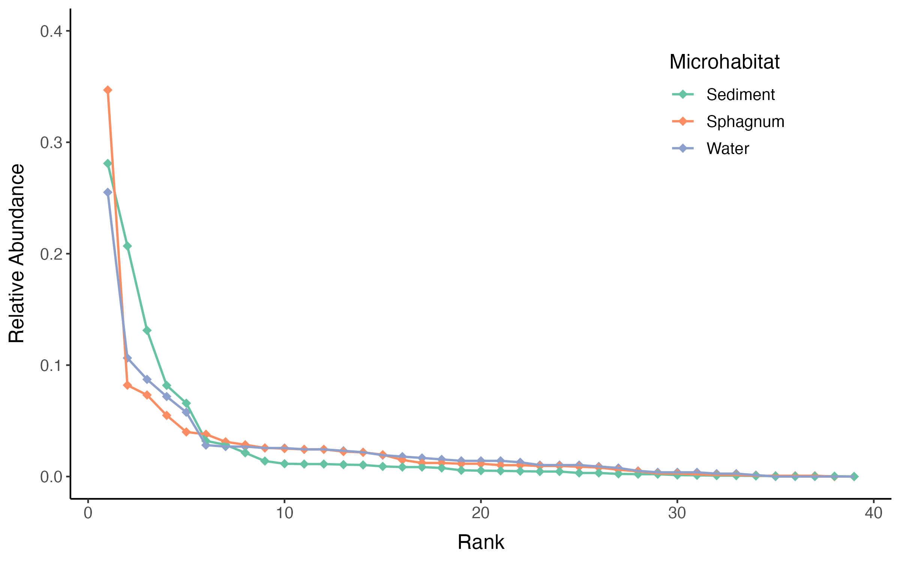 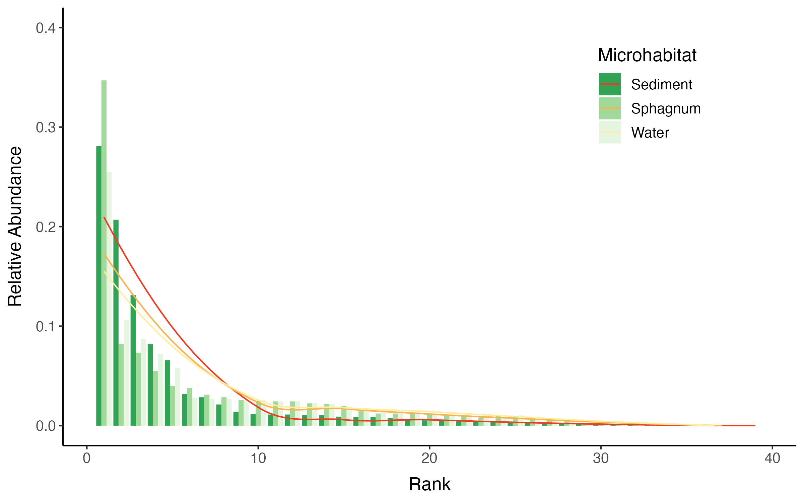

Since the palettes used are very different, it makes our plots look almost unrelated. That's the power of colour! Once again, if we are aiming to see differences in microhabitats then the bar plot is better suited, but the scatter plot looks nicer and is easier to read straightforwardly. To decide on plot colour factors to include, of which there are MANY, you should fully consider the context of your data visualisation: are you aiming to publish this for the general public? Or is it as a part of a scientific report? And of course think about what your plot interpretations are, since these can be better represented and emphasised through colours. 
 
<a name="section2.4"></a>
### 2.4. Scientific journal colour palettes (ggsci)
 
Many of you will be interested in these palettes if you are scientists and looking for professional-looking colour schemes! This time we will simply list the main functions for these and give a couple of examples, since by now you should have more or less understood how the various colour functions work.
 
To see the full extent of ggsci palettes, go to [this website](https://cran.r-project.org/web/packages/ggsci/vignettes/ggsci.html), where they are listed with examples. 

We will only take a closer look at a two of them:
 
- NPG: `scale_color_npg()` and `scale_fill_npg()`, for discrete scales.
- Material Design: `scale_color_material()` and `scale_fill_material()`, for continuous scales.

Here are examples using our data:
``` r  
# NPG
install.packages("ggsci")
library(ggsci)

# Scatter by group using NPG package:
(NPGscatter <-  ggplot(data = rankabundance, 
                         aes(x = rank , 
                             y = relativeabundance ,
                             colour = microhabitat)) +
    geom_point(size = 2.5, shape=18) +
    geom_line(size = 0.7) +
    scale_colour_npg() +
    ylim(0, 0.4) +
    labs(x = "Rank", y = "Relative Abundance", colour = "Microhabitat") +
    theme_classic() +
    theme(text = element_text(size = 13),
          legend.position = c(0.8, 0.8),
          axis.title.x = element_text(margin=margin(t=8)), 
          axis.title.y = element_text(margin=margin(r=8))))
``` 
``` r
# Material Design
# These colours require an extra package installed 
install.packages("shiny")
library(shiny)

# Bar plot using Material Design colour 
(MaterialDesign <-  ggplot(data = rankabundance, 
                         aes(x = rank , 
                             y = relativeabundance,
                             group = microhabitat)) +
    geom_bar(stat = 'identity', 
             position = position_dodge(),
             aes(fill = relativeabundance)) +
    scale_fill_material("light-blue") +
    geom_smooth(aes(colour = microhabitat), size = 0.8, se = F) +
    scale_colour_manual(values = c("#D41357", "#029149", "#990697")) +
    ylim(0, 0.4) +
    labs(x = "Rank", y = "Relative Abundance", fill = "Relative abundance", colour = "Microhabitat") +
    theme_classic() +
    theme(text = element_text(size = 13),
          legend.position = c(0.8, 0.6),
          axis.title.x = element_text(margin=margin(t=8)), 
          axis.title.y = element_text(margin=margin(r=8))))
 ```
The code remains similar to that seen in the beginning, simply adding the new function names and defining the option if needed (e.g., light-blue).  Note: in the bar plot, we gave the smooth lines manual values because they needed to fit with the blue gradient (getting colours to mesh well together is harder than it looks). 
 
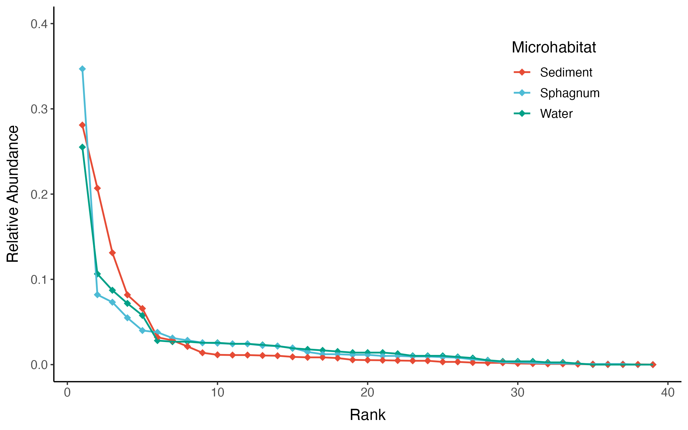 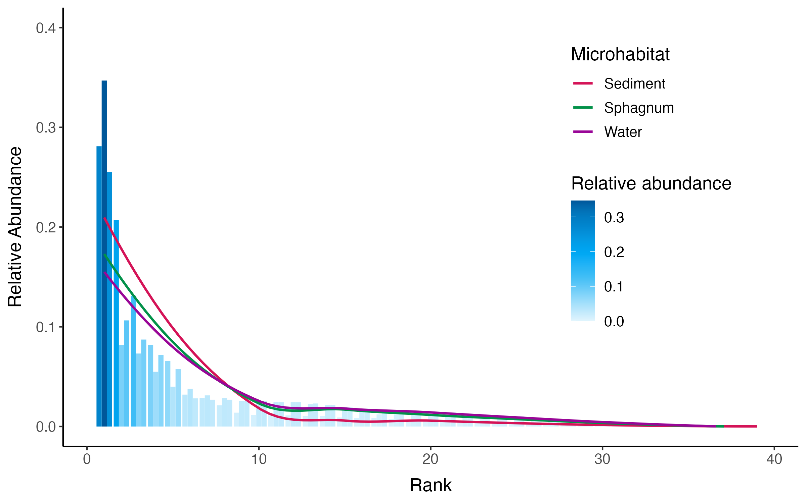

The graphs look good, but not all that amazing considering the colour schemes are inspired by scientific journals. To challenge yourself, you could try to find the most corresponding theme for you by looking at all the different options! You might be here a while though. 

<a name="section2.5"></a>
### 2.5. Wes Anderson colour palettes

Finally, our last colour palettes belong to the Wes Anderson package.

``` r
# Install and Load
devtools::install_github("karthik/wesanderson")
library(wesanderson)
names(wes_palettes) # view the range of palettes by name
```

The function to use a Wes Anderson palette is
`wes_palette('name', n, type = c("discrete", "continuous"))`,
where 'name' is the palette name, n is the number of colours desired and type is either discrete or continuous depending on data.

Applying Wes palettes in ggplot2 is quite straightforward:

`scale_fill_manual(values = wes_palette("name", n = n))`

Let's look at 2 final examples using our data.

``` r
(WesAnderson1 <-  ggplot(data = rankabundance, 
                       aes(x = rank , 
                           y = relativeabundance ,
                           colour = microhabitat)) +
    geom_point(size = 2.5, shape=18) +
    geom_line(size = 0.7) +
    scale_colour_manual(values = wes_palette("Moonrise3")) +
    ylim(0, 0.4) +
    labs(x = "Rank", y = "Relative Abundance", colour = "Microhabitat") +
    theme_classic() +
    theme(text = element_text(size = 13),
          legend.position = c(0.8, 0.8),
          axis.title.x = element_text(margin=margin(t=8)), 
          axis.title.y = element_text(margin=margin(r=8))))
```

Now for our bar plot if we want to use the gradient again, we first have to make a palette. We selected the palette as 'Moonrise3', then how big the gradient (higher numbers mean slower changes in colour, whereas small numbers mean the gradient changes faster), and the type of data it is for (i.e., continuous). We then apply it to our continuous variable using the `scale_fill_gradientn()` function that we briefly mentioned earlier. This allows us to apply a gradient of size 'n', or 100 in our case. 

``` r
# For a gradient scale, we first have to make a palette:

gradientpalette <- wes_palette("Moonrise3", 100, type = "continuous")
	
# Bar plot using colour Wes Anderson gradient created (gradientpalette)
(WesAnderson2 <-  ggplot(data = rankabundance, 
                           aes(x = rank , 
                               y = relativeabundance,
                               group = microhabitat)) +
    geom_bar(stat = 'identity', 
             position = position_dodge(),
             aes(fill = relativeabundance)) +
    scale_fill_gradientn(colours = gradientpalette) +
    geom_smooth(aes(colour = microhabitat), size = 0.8, se = F) +
    scale_colour_manual(values = wes_palette("Royal2")) +
    ylim(0, 0.4) +
    labs(x = "Rank", y = "Relative Abundance", fill = "Relative abundance", colour = "Microhabitat") +
    theme_classic() +
    theme(text = element_text(size = 13),
          legend.position = c(0.8, 0.6),
          axis.title.x = element_text(margin=margin(t=8)), 
          axis.title.y = element_text(margin=margin(r=8))))
```
Et voilà! This is how our final plots turned out:
 
 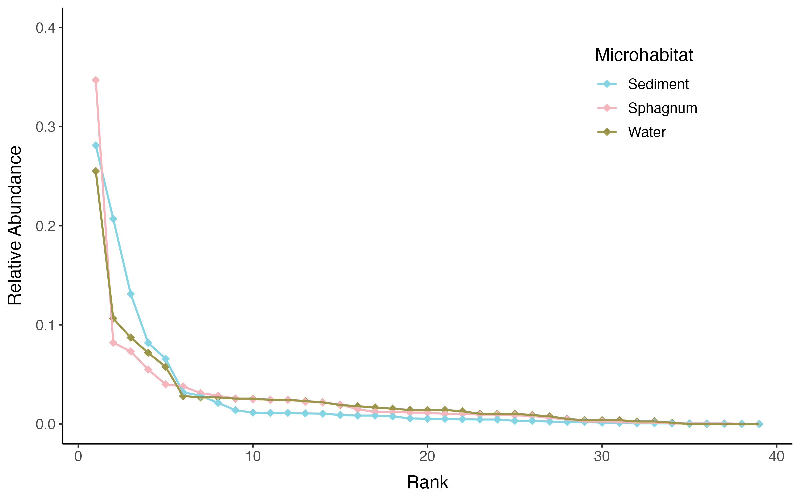 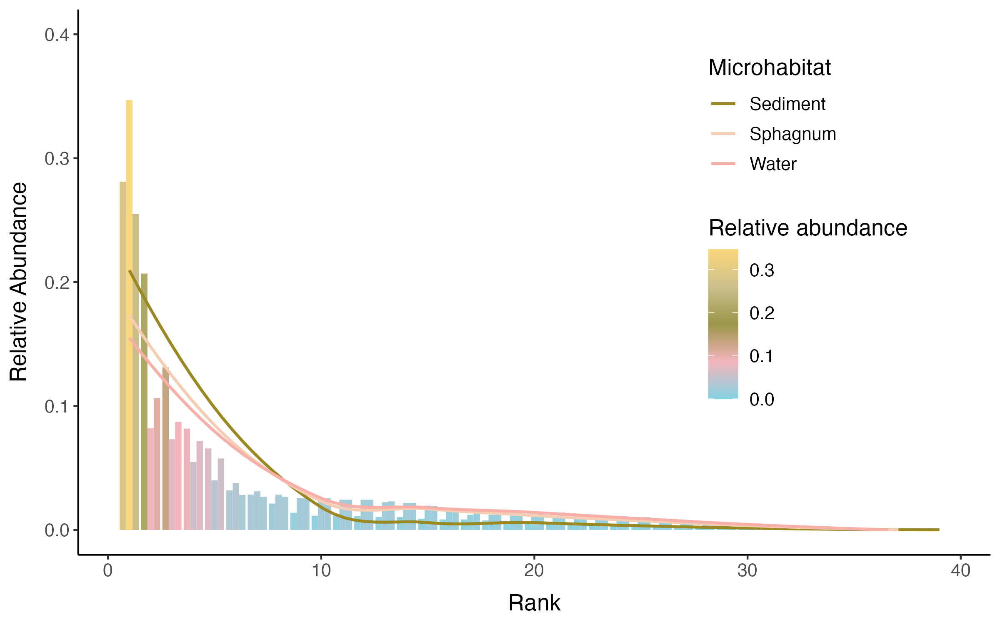

This version of the bar plot seems to portray the gradient best and isn't too harsh to look at (yes colour can be TOO much). The Wes Anderson palettes are quite diverse and provide quite professional looking plots, especially since you can create your own gradient using `wes_palette`. 

<a name="section3"></a>
## 3. Compare and challenge yourself

Now it's your turn! If you haven't been changing the colours from those we used in the tutorial, go back and test other options to find your favourites.
Knowing which palettes suit your style of plot can save you a lot of time in the future, so having a couple of these palettes ready for your next graphs could be useful. 
Altogether we looked at 15 plots of the EXACT same data and somehow they all look contrastingly different. Some were definitely prettier than others, and a few provided better interpretation of our results by accentuating the rank-abundance curves. 

After completing this tutorial, you should be able to:

##### - use and understand the main colour functions in ggplot2
##### - apply colour in a way that amplifies your results or what you want people to notice from your figure
##### - make use of external colour packages to find your own colour scheme or match a specific style


For more on `ggplot2`, read the official <a href="https://www.rstudio.com/wp-content/uploads/2015/03/ggplot2-cheatsheet.pdf" target="_blank">ggplot2 cheatsheet</a>.

Everything below this is footer material - text and links that appears at the end of all of your tutorials.

<hr>
<hr>

#### Check out our <a href="https://ourcodingclub.github.io/links/" target="_blank">Useful links</a> page where you can find loads of guides and cheatsheets.

#### If you have any questions about completing this tutorial, please contact us on ourcodingclub@gmail.com

#### <a href="INSERT_SURVEY_LINK" target="_blank">We would love to hear your feedback on the tutorial, whether you did it in the classroom or online!</a>

<ul class="social-icons">
	<li>
		<h3>
			<a href="https://twitter.com/our_codingclub" target="_blank">&nbsp;Follow our coding adventures on Twitter! <i class="fa fa-twitter"></i></a>
		</h3>
	</li>
</ul>

### &nbsp;&nbsp;Subscribe to our mailing list:
<div class="container">
	<div class="block">
        <!-- subscribe form start -->
		<div class="form-group">
			<form action="https://getsimpleform.com/messages?form_api_token=de1ba2f2f947822946fb6e835437ec78" method="post">
			<div class="form-group">
				<input type='text' class="form-control" name='Email' placeholder="Email" required/>
			</div>
			<div>
                        	<button class="btn btn-default" type='submit'>Subscribe</button>
                    	</div>
                	</form>
		</div>
	</div>
</div>
